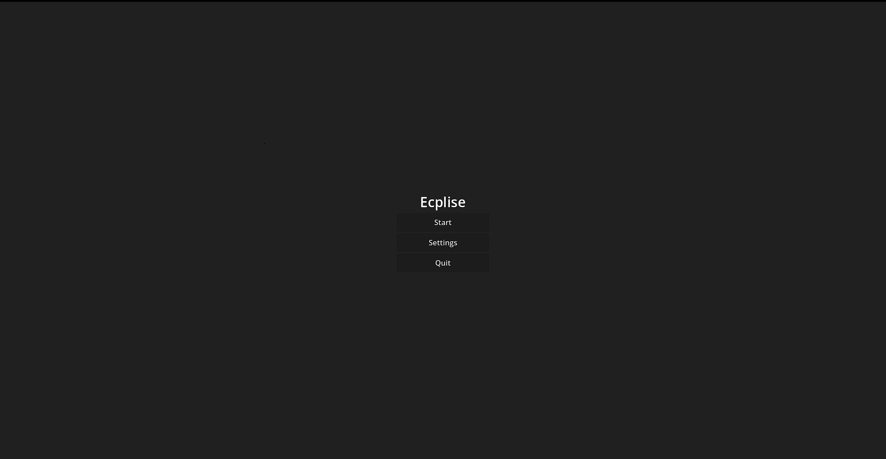
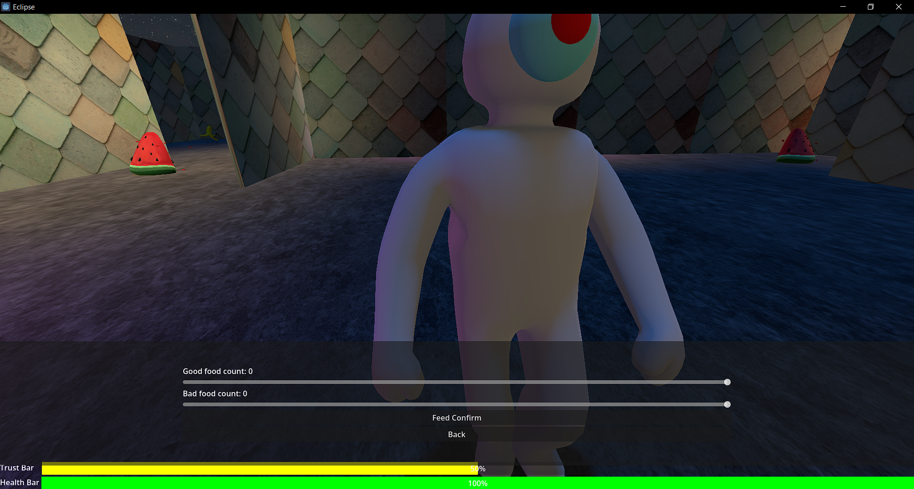
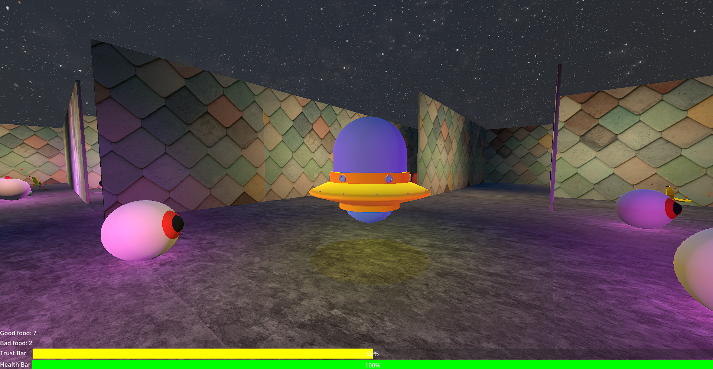
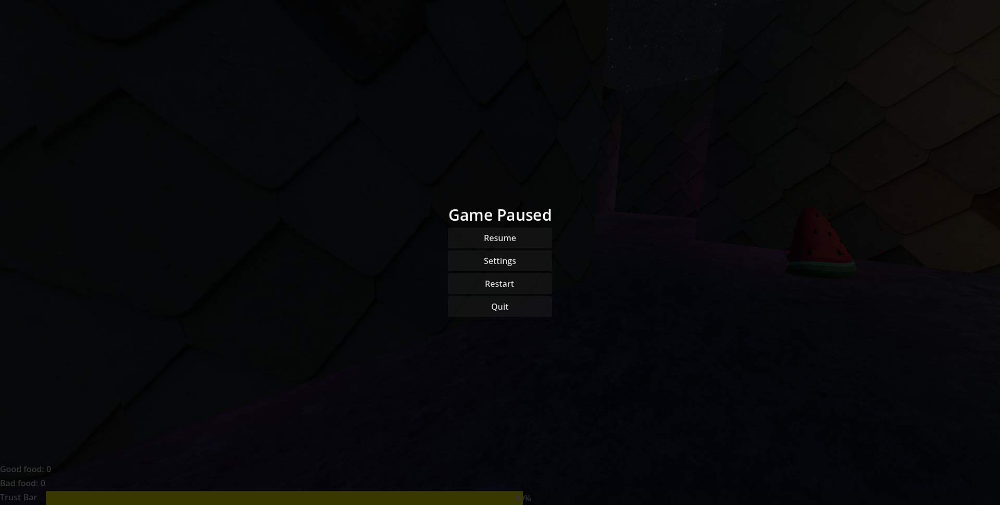
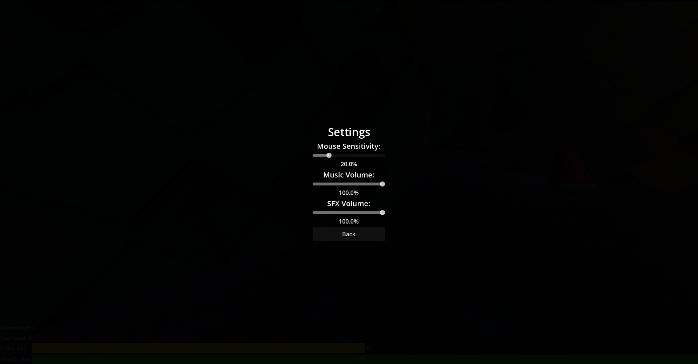
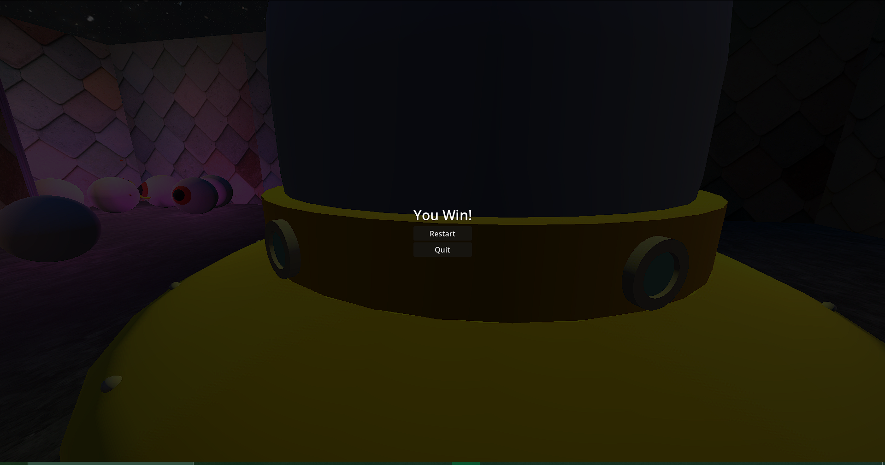
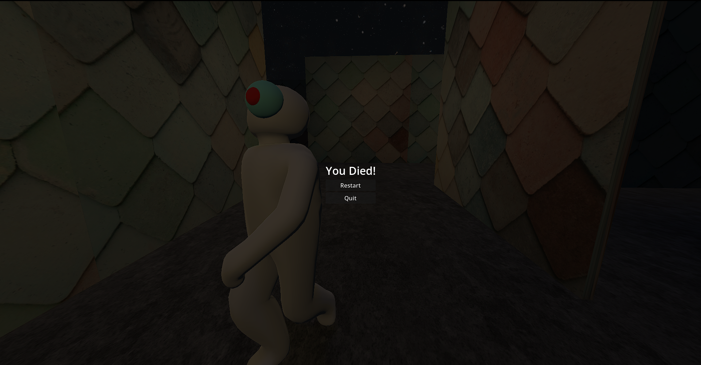

# Autonomous Agents 2026 Assignment

Sentient extra terrestrial life form!

## Overview
### Gameplay:
The game places the player inside a procedurally generated maze where each run creates a new layout. The player must navigate through the maze, and interact with the world while searching for the exit (a spaceship hidden in an open area).

throughout the maze are food items that the player can collect and feed to an alien. These choices directly influence a dynamic trust system: feeding the alien good food increases its trust, while bad food reduce it. The alien’s behaviour changes based on this trust level, making it either more cooperative or more hostile.

### Alien:
The alien is a AI-driven entity that reacts to the player based on trust. Its behaviour evolves throughout the game depending on how the player chooses to interact with it through feeding.

The player can feed the alien two types of food found throughout the maze: good food and bad food. These directly affect the alien’s state. Good food increases trust and playfulness, while bad food increases fear and aggression. Over time, these values decay slightly, meaning the aliens emotional state is always shifting.

The aliens trust level is the primary factor that determines its behaviour:

0–10% Trust: The alien becomes aggressive and will actively pursue the player using a navigation mesh system. If it reaches the player, it will attack.
11–39% Trust: The alien becomes fearful and will attempt to flee from the player, avoiding direct interaction.
40–60% Trust: The alien is curious and will actively seek the player, staying nearby and observing their actions.
61–89% Trust: The alien becomes playful and will wander the environment, showing relaxed behaviour.
90–100% Trust: The alien becomes fully trusting and will guide the player, leading them toward the exit spaceship.

## Screenshots
Main menu

Alien and gameplay UI

Feed UI

Bad food

Good food

Boids

Spaceship

Pause menu

Settings menu

Win menu

Death menu

## Video

## Resources

Boids - Me

[Night sky box](https://ambientcg.com/a/NightSkyHDRI001)

[Alien Crunch Munch](https://pixabay.com/sound-effects/people-munchin-95618/)

[Gameplay Background Music](https://pixabay.com/sound-effects/musical-mystical-music-54294/)

[Alien Model](https://sketchfab.com/3d-models/simple-humanoid-53dcd7cf86a4461d963b3c7efa83bc4e) (modified slightly by me)

[Wall Tiles](https://pixabay.com/photos/tiles-shapes-texture-pattern-art-2617112/)

[Floor Texture](https://www.magnific.com/free-photo/black-damage-wall_1035024.htm#fromView=keyword&page=1&position=17&uuid=f479e17e-e892-4f86-ae58-74a2fea15674&query=Floor+texture+seamless+free)

[Watermelon](https://sketchfab.com/3d-models/cute-watermelon-ae853054c7cd4fd39e6c29fbd3322779#download)

[Banana Peel](https://sketchfab.com/3d-models/banana-peeltrash-low-poly-fe8ac13bc7144583bb9d03a21ac59ded#download)

[UFO](https://sketchfab.com/3d-models/chibi-ufo-low-poly-26fc3ada37264aa482b02e3d38ed1ba6#download)
